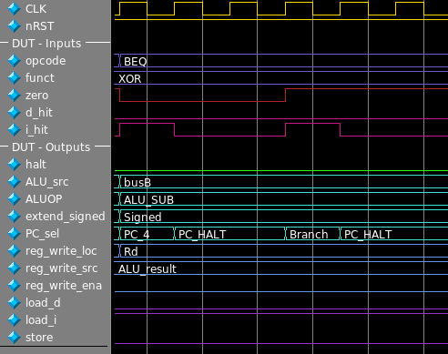

# Verification
We've seen in the last two articles some Verilog code used to describe hardware modules. The process of testing and verifying Verilog designs is very different from typical software workflows. Remember, we are designing hardware circuitry, not writing instruction-based programs. To test our hardware modules, we will use a construct called a testbench. This is conceptually like taking our prototype circuit, and supplying a series of input signals that change over time, and checking the circuit outputs to make sure that they match expected outputs. Of course, this raises the obvious question, how do we know what the expected outputs are? When we test a full CPU, we can use a program that simulates the ISA and compare the ISA simulation results with the hardware simulation results. But what if we want to test a smaller module of the CPU? We don't have a standard reference or model for the sub-components. In this instance, we will look at the control module and instruction decoder of our CPU. Let's take a look at the Control module and see how we go about verifying our design.


# Quick summary of the Control Unit
The control unit is the conductor of the CPU. This specific iteration of the control unit comes from our single-cycle CPU design. This is before we added pipeline stages, or a cache. In this design the CPU executes one instruction every clock cycle, and each instruction takes one clock cycle to complete. The implication of this is that our logic signals must traverse many logic gates per clock cycle, and thus the maximum operating frequency is extremely low. However, creating a functioning single-cycle CPU will give us a strong foundation when we eventually insert pipeline stages.

The module deceleration below uses many custom type declarations, these are similar to custom types in C. They are simply an alias for language primitives. Some of these are enumerations, which gives us the flexibility to assign labels that are easier for the programmers to read. The synthesis will take care of the actual values.

```verilog
module control_unit (
	// INPUTS
	input logic zero,
	input opcode_t opcode, 
	input funct_t funct,
	input logic d_hit, i_hit,
	// OUTPUTS
	output ALU_src_t ALU_src, 
	output aluop_t ALUOP,
	output extend_signed_t extend_signed,
	output logic load_d, load_i,
	output PC_sel_t PC_sel,
	output logic reg_write_ena, 
	output reg_write_t reg_write_loc, 
	output reg_write_src_t reg_write_src,
	output logic store,
	output logic halt
	);
```

I won't go over each signal in detail, but we can see that this module has a few inputs and many outputs. Noticeably lacking is the clock signal ```CLK```. Because this module contains no flip-flops, it does not need the clock signal. Every output of this module is determined only by the current inputs, and the outputs will change as soon as the inputs change, this is unlike the Register Unit we saw earlier, who's outputs only change on the rising edge of the clock signal.

Lets look specifically at the ```PC_sel``` output. We'll go over it's significance, and then follow the process of ensuring that it functions correctly. If we want to eventually fabricate an actual integrated circuit using our Verilog code, we want to be absolutely sure that it functions correctly. Below is the definition of the ```PC_sel_t``` custom data type.

```verilog
typedef enum logic [2:0] {
	PC_4,
	Branch,
	J_reg,
	J_imm,
	PC_HALT
	} PC_sel_t;
```

This signal controls what value should be loaded into the Program Counter (PC) for the next instruction (The PC is simply the address of the instruction currently being executed). We will group all instructions from the ISA into the five categories above. Most instructions do not modify the program counter, and in these cases, we simply increment the counter by 4 to address the next instruction in the program (we add 4 because each instruction is four bytes long). Examples of these types of instructions are ```ADD```, ```LW```, ```XOR```. These operate on register data, and do not change the program flow, in this enum they are represented by ```PC_4```. The next four options are more interesting. ```Branch``` will take some value encoded into the instruction and add it to the current program counter, but only if some conditions are met. There are two instructions in this category: ```BEQ``` and ```BNE```.  The category ```J_reg``` will set the value of the program counter to the value of a specified register. This encoding is only used for the ```JR``` instruction. The ```J_imm``` is used by the ```J``` and ```JAL``` instructions and sets the value of the PC directly from a value encoded into the instruction itself. Finally, and perhaps most interesting of all, ```PC_HALT``` . This signal goes high when the current instruction is ```HALT``` and sets the next value of the PC to the current value. This essentially forces the CPU into an infinite loop. Halting all program execution. The CPU cannot recover from a halt without outside intervention.

# ```PC_sel``` in action

The screenshots below come from MentorGraphics' Modelsim software. The environment provided by the course staff included helpful scripts to get us up and running with Modelsim testbenches and simulation. Now that I no longer have access to Purude's servers, I've been hacking together a way to run Modelsim on my Arch Linux desktop. The solution I've settled on uses a Docker container to manage the library dependencies. It's been an involved process to create these screenshots, so let's dive in and take a look.



This screenshot shows a graph of inputs and outputs of our control unit as they change over time. The inputs are set by the testbench, and the outputs are created by the simulated hardware. This is where our enumerations really shine. We don't know or care what the bit encoding of our signals are, we just care that the labels are correct. Let's dissect what's happening in this first picture, and hopefully we'll gain some understanding of our control unit. Our functions outputs change whenever the inputs change, but for this testbench I've chosen to only change inputs on the rising edge of the clock, just for my own sanity. At the first rising edge of the clock, the ```OPCODE``` is ```BEQ``` (Branch if Equal) and the value of ```zero``` is ```0```. Here ```zero``` is a single wire, and it acts a little like a boolean; it is high if the output from the ALU is zero, and low otherwise. The controller is telling the ALU to subtract ```ALUOP = ALU_SUB```, and because ```zero``` is low, the branch if equal should not be taken! The controller sets ```PC_sel``` to ```PC_4```.

In the next clock cycle, the value of ```PC_sel``` is ```PC_HALT```. What happened? There wasn't a halt instruction! This is a feature of our control unit, and allows our single cycle processor to function with a memory latency of more than one clock cycle. The signal ```i_hit``` goes high only if the data coming from memory is valid. The ```PC_HALT``` just tells the program counter not to advance, because the instruction hasn't arrived yet.

A few more clock cycles progress as we wait for the memory to return the next instruction. Finally it arrives, its still ```BEQ``` but this time ```zero``` is high! The CPU should take the branch! ```PC_sel``` takes the value ```Branch``` and the program counter will use the value encoded in the instruction to calculate the destination address.

# A glimpse of the testbench code

So, we've seen a simulation of a module in action, let's look at some of the code that drove the inputs. Remember, we're simulating the control module in isolation. We've used Verilog tasks (very similar to functions) to implement our testbench, so each one of these test cases is a single line of code!

```verilog
supply_inputs(1'b0, BEQ, XOR);
supply_inputs(1'b1, BEQ, XOR);
```

The real work happens in the ```supply_inputs``` task, which takes the module inputs as arguments and controls the actual signals supplied to the simulated control module.
Notice how it doesn't matter what the ```funct``` field of the instruction is for this particular test-case. I've supplied ```XOR```, but the control module tells the ALU to subtract, this is because that subtraction is the comparison we need to branch if equal. In the completed CPU these bits would just be garbage, they would be some subset of the destination of the branch.

```verilog
task supply_inputs;
  input logic zero;
  input opcode_t opcode;
  input funct_t funct;
  begin
    cuif.i_hit = 1'b0;
    for (int i = 0; i < LAT; i++)
	  @(posedge CLK);
	  
    cuif.i_hit = 1'b1;
    cuif.zero = zero;
    cuif.opcode = opcode;
    cuif.funct = funct;
     
    if (opcode == LW || opcode == SW)
      begin
        @(posedge CLK);
        cuif.i_hit = 1'b0;
        for (int i = 0; i < LAT; i++)
          @(posedge CLK);
        cuif.d_hit = 1'b1;
        @(posedge CLK);
        cuif.d_hit = 1'b0;
      end
    else
      @(posedge CLK);
	end
endtask // supply_inputs
```

The code above supplies inputs to the control module, but doesn't test their outputs! This is a big oversight if we wanted to run lots of tests and be certain of this modules correctness. I wrote this particular testbench early on in my computer architecture class, and reviewed the results by hand. This particular hardware module is simple enough to make this feasible. By the time I got to writing the caches, my testbenches were validating the modules outputs on every clock cycle.
