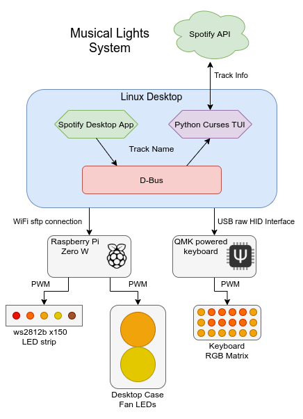

# Introduction

Page under construction
{: .label .label-yellow }

This is a summary of my independent project to integrate RGB lighting and my spotify desktop player to create dynamic and subltle mood lighting.

### The LEDs custom protocol *(coming soon)*
### Converting music to color *(coming soon)*
### Managing the Finite State Machine *(coming soon)*
### The Raspberry Pi client *(coming soon)*
### The QMK keyboard client *(coming soon)*

# Tools
  * Raspberry Pi zero W
  * Planck EZ GLOW (STM32F303 microcontroller)
  * QMK keyboard firmware
  * Systemd
  * Python
  * C
